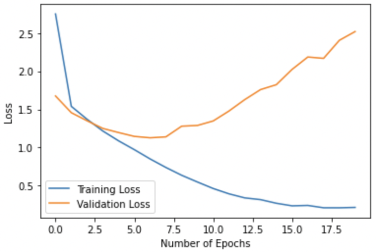

In this project, we will attempt to solve an Image Classification problem using Convolutional Neural Networks. In a [previous post](https://oppongk23.github.io/Image-Classification-ANN/), we looked at this same task but with a Multi-layered perceptron instead. Like in the previous post, we will look at overfitting and how we can reduce it. There are so many really good architectures out there that would provide really great accuracies; the models in this project are way more simplified than those and the purpose of this project is to really look at overfitting and how we can reduce it.

If you are more interested in the just the ccode, it is available over [here](https://github.com/oppongk23/Image-Classification-CNN/blob/main/CIFAR-10_CNN.ipynb).

#### Convolution and CNNs
Generally, in math, convolution represents an operation between two functions in which another function is produced. This third function, usually quantifies the way in which one function modifies the other function. CNNs leverage this very important ability to extract features from images from basic shapes to advanced features. These features are then sent as inputs to Multi-layer perceptrons to learn from, and to classify.

#### Dataset
The CIFAR-10 dataset is used in this project as it was in the previous one. The dataset is a collection of about 60,000 32x32 small RGB images. The dataset is also divided into two sets: a training set and a test set. The training dataset comprises 50,000 images divided into batches of 10,000 images and the test dataset comprises 10,000 images. There are 10 different classes in the dataset and each training batch contains 1,000 images from each class.

#### Importing Dependencies
We begin by importing the tensorflow and keras libraries along with some other modules in those libraries.

```
import tensorflow as tf
from tensorflow import keras
import numpy as np
import matplotlib.pyplot as plt
from keras.datasets import cifar10
from keras import regularizers
from tensorflow.keras.models import Sequential
from tensorflow.keras.layers import Conv2D, Dense, MaxPool2D, Flatten, Dropout, BatchNormalization
```


#### Dataset Preparation
We then download the dataset and plot a few images from there.

```
# Downloading the cifar10 dataset 
(x_train, y_train), (x_test, y_test) = cifar10.load_data()

# Plotting the first 10 images
display_images = X_train_gray.reshape(-1, 32,32)
fig, axes = plt.subplots(1, 10, figsize = (30, 10))
for img, ax in zip(display_images[:10], axes):
  ax.imshow(img, cmap=plt.get_cmap('gray'))
plt.show()

```

After plotting, we have the image below:


#### Building the first model
In this very first model, we are going to attempt to use a _CONV-POOL-CONV-POOL-CONV-POOL-FC-FC_ architecture. 
We will use 3×3 filters with 32, 64, and 64 channels respectively. We will use a stride of 1 was and _same_ padding to ensure that the dimensions of the input and output images are going to be the same. We follow each convolution(CONV) and dense(FC) layer with a ReLU activation and we use pooling operations (POOL) in between. We use a pooling operator with a stride of 2 and a 2 × 2 kernel and this generally halves the image size. We will also use the Adam optimizer and a fifth of the training set will e used as the validation set. The training will run for 20 epochs.
```
model = Sequential()
model.add(Conv2D(32, (3,3), strides=(1,1), padding='same', activation='relu', input_shape=(32, 32, 3)))
model.add(MaxPool2D((2,2), strides=(2,2)))

model.add(Conv2D(64, (3,3), strides=(1,1), padding='same', activation='relu'))
model.add(MaxPool2D((2,2), strides=(2,2)))

model.add(Conv2D(64, (3,3), strides=(1,1), padding='same', activation='relu'))
model.add(MaxPool2D((2,2), strides=(2,2)))

model.add(Flatten())

model.add(Dense(units=1024, activation='relu'))
model.add(Dense(units=10, activation='softmax'))


# Compiling the model with the adam optimizer, cross entropy loss, and accuracy as the metric
model.compile(optimizer="adam", loss = "sparse_categorical_crossentropy", metrics=["accuracy"])


#training the model
training_summary = model.fit(x_train, y_train, epochs=20, batch_size=128, validation_split=0.2)

```


#### Analysing the results
We plot the training and validation losses and accuracies, to see how the model performs on both the training and validation sets.
Below is the plot of the training and validation losses.




Also, we can take a look at the training and validation accuracies.
 


We can note a few things from both plots. From the first plot, it is apparent that the training loss kept reducing with each epoch. At the first epoch, the training loss was around 2.1 and the validation loss was around 2.0. After the 7th epoch, the training loss kept reducing but the validation loss went up till it descended to a plateau after the 10th epoch. At the 20th epoch, the validation loss was about 1.71 and the training loss was 1.39. 

From the second plot, the training accuracy is on a fairly straightforward trajectory. It increases from around 21% and it is around *50.35%* by the 20th epoch. The validation accuracy on the other hand starts to increase steadily till it plateaus at about *40.85%* which indicates a difference of about 10% between both accuracies. 

The huge difference between the accuracies and the loss values show that the model does not generalize very well and that translates to a typical case of an **_overfitted_** model.

When the model is ran on the test set, the accuracy is around *40.96%*. 


#### Improving the model performance
Overfitting usually means that the model in question has learnt higher level peculiarities about the training data that aren't exactly necessary. One way of dealing with overfitting is to **_reducing the complexity_** of the model. This way you reduce the _capacity_ of the model and hence, its ability to learn all the overly complex features from the training data.

We can construct a simpler model. This model will have 4 hidden layers instead of 8 with 512, 256, 64, and 32 units respectively.

```
second_model = keras.Sequential([keras.layers.Flatten(input_shape = (32, 32)), 
                          keras.layers.Dense(512, activation="relu"),
                          keras.layers.Dense(256, activation="relu"),
                          keras.layers.Dense(64, activation="relu"), 
                          keras.layers.Dense(32, activation="relu"),
                          keras.layers.Dense(10, activation= "softmax")])
                   
# Compiling the model with the adam optimizer, cross entropy loss, and accuracy as the metric
second_model.compile(optimizer="adam", loss = "sparse_categorical_crossentropy", metrics=["accuracy"])

# Training the model
second_training_summary = second_model.fit(X_train_gray, y_train, epochs=20, batch_size=128, validation_split=0.2)
```

#### Results
We can look at the results below.
Below is the plot of the training and validation losses.


Also, we can take a look at the training and validation accuracies.
 

We have the training accuracy rising steadily in this simulation till it reaches 48% while the validation accuracy plateaus to a value of 40.96%. The difference between the validation and the training accuracy reduces to about 7% from 10% in the first model. The training loss descends to a value of 1.4585 while the validation loss is 1.6585. In this case, the training loss increases slightly from the value of the earlier model but the validation loss decreases from a value of 1.71 in the first model to a value of 1.43 in this second model which indicates an approximately 3% decrease in value. The decrease in the gap between the validation loss and the training loss indicates that the model, as a result of the reduction in complexity, has reduced overfitting. 


#### Adding Weight Decay
Another method of improving the generalization performance of a model is by adding weight decay. This way we are able to penalize our model when it becomes overly complex. Weight decay is added to the model as shown below:

```
regularized_model = keras.Sequential([keras.layers.Flatten(input_shape = (32, 32)), 
                          keras.layers.Dense(512, activation="relu", kernel_regularizer= regularizers.l2(0.0008)),
                          keras.layers.Dense(256, activation="relu", kernel_regularizer= regularizers.l2(0.0008)),
                          keras.layers.Dense(64, activation="relu", kernel_regularizer= regularizers.l2(0.0008)), 
                          keras.layers.Dense(32, activation="relu", kernel_regularizer= regularizers.l2(0.0008)),
                          keras.layers.Dense(10, activation= "softmax")])
 
# Compiling the model with the adam optimizer, cross entropy loss, and accuracy as the metric
regularized_model.compile(optimizer="adam", loss = "sparse_categorical_crossentropy", metrics=["accuracy"])

# Training the model
regularized_training_summary = regularized_model.fit(X_train_gray, y_train, epochs=20, batch_size=128, validation_split=0.2)
```

We can look at how the model reacts to the regularization implemented.


We can observe the training and validation accuracies.
 

Now by eye-balling the graphs, we can see that the model's performance metrics on both the training and validation datasets are quite similar. The training accuracy is about *42.22%* and the validation accuracy is about *40.15%* at the 20th epoch. As mentioned earlier we can observe that the gap between the training accuracy and validation accuracy has been reduced to just *2.07%*. The gap between the losses also reduces with the training loss being around 1.72 and the validation loss being around 1.77. 
This, along with the accuracies simply means that the model’s ability to generalize has improved significantly.


#### The Final Model
In this final model, we add a Dropout Layer to the previous model. Dropout Layers work by terminating some neurons. This way the model learns while being 'handicapped' and this helps to improve the model's generalization performance. 
This is implemented as shown below.
```
# Creating the model with 8 hidden layers aside the input and output layers
reg_drop_model = keras.Sequential([keras.layers.Flatten(input_shape = (32, 32)), 
                          keras.layers.Dense(512, activation="relu", kernel_regularizer= "l2"),
                          keras.layers.Dense(256, activation="relu", kernel_regularizer= "l2"),
                          keras.layers.Dense(64, activation="relu", kernel_regularizer= "l2"), 
                          keras.layers.Dense(32, activation="relu", kernel_regularizer= "l2"),
                          keras.layers.Dropout(0.2, noise_shape=None, seed=None),
                          keras.layers.Dense(10, activation= "softmax")])
                          
# Compiling the model with the adam optimizer, cross entropy loss, and accuracy as the metric
reg_drop_model.compile(optimizer="adam", loss = "sparse_categorical_crossentropy", metrics=["accuracy"])

# Training the model
reg_drop_training_summary = reg_drop_model.fit(X_train_gray, y_train, epochs=20, batch_size=128, validation_split=0.2)
```
The performance is summarized in the graphs below.


The accuracies are also shown below.


 

With the Dropout layer included, the training loss increases to 1.78 and the validation loss increases to around 1.80. The accuracies also reduce to 39.86% for training and 38.55% for validation. However, the difference between both accuracies reduces to just 1.31%. This indicates that the dropout layer did well to help the model generalize better. 


Finally, in this project we tried to use Artificial Neural Networks to implement an image classification task. We see how the model overfits to the training set. We tried to reduce the overfitting and to make sure the model maintains similar levels of performances with both training and validation sets. We looked at capacity reduction, regularization, and the use of dropout layers. There are other ways to improve generalization, such as BatchNormalization. We will take a look at that when we talk about CNNs. 

If you have any questions you can hit me up through [Email](mailto:coboakyemensah@gmail.com), [Twitter](https://twitter.com/__oppong), or [LinkedIn](https://www.linkedin.com/in/clifford-boakye-mensah-031aa8142/).

Enjoy!
