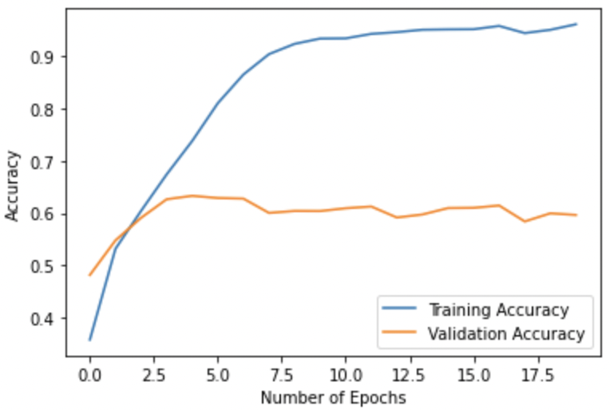
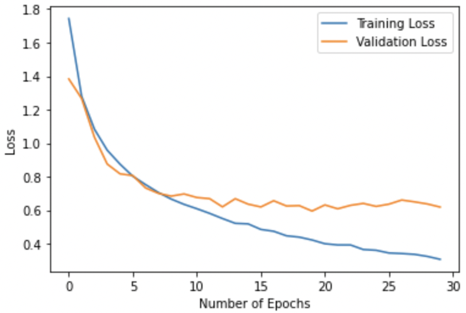

In this project, we will attempt to solve an Image Classification problem using Convolutional Neural Networks. In a [previous post](https://oppongk23.github.io/Image-Classification-ANN/), we looked at this same task but with a Multi-layered perceptron instead. Like in the previous post, we will look at overfitting and how we can reduce it. There are so many really good architectures out there that would provide really great accuracies; the models in this project are way more simplified than those and the purpose of this project is to really look at overfitting and how we can reduce it.

If you are more interested in the just the code, it is available over [here](https://github.com/oppongk23/Image-Classification-CNN/blob/main/CIFAR-10_CNN.ipynb).

#### Convolution and CNNs
Generally, in math, convolution represents an operation between two functions in which another function is produced. This third function, usually quantifies the way in which one function modifies the other function. CNNs leverage this very important ability to extract features from images from basic shapes to advanced features. These features are then sent as inputs to Multi-layer perceptrons to learn from, and to classify.

#### Dataset
The [CIFAR-10 dataset](https://www.cs.toronto.edu/~kriz/cifar.html) is used in this project as it was in the previous one. The dataset is a collection of about 60,000 32x32 small RGB images. The dataset is also divided into two sets: a training set and a test set. The training dataset comprises 50,000 images divided into batches of 10,000 images and the test dataset comprises 10,000 images. There are 10 different classes in the dataset and each training batch contains 1,000 images from each class.

#### Importing Dependencies
We begin by importing the tensorflow and keras libraries along with some other modules in those libraries.

```
import tensorflow as tf
from tensorflow import keras
import numpy as np
import matplotlib.pyplot as plt
from keras.datasets import cifar10
from keras import regularizers
from tensorflow.keras.models import Sequential
from tensorflow.keras.layers import Conv2D, Dense, MaxPool2D, Flatten, Dropout, BatchNormalization
```


#### Dataset Preparation
We then download the dataset and plot a few images from there.

```
# Downloading the cifar10 dataset 
(x_train, y_train), (x_test, y_test) = cifar10.load_data()

# Plotting the first 10 images
display_images = X_train_gray.reshape(-1, 32,32)
fig, axes = plt.subplots(1, 10, figsize = (30, 10))
for img, ax in zip(display_images[:10], axes):
  ax.imshow(img, cmap=plt.get_cmap('gray'))
plt.show()

```

After plotting, we have the image below:


#### Building the first model
In this very first model, we are going to attempt to use a _CONV-POOL-CONV-POOL-CONV-POOL-FC-FC_ architecture. 
We will use 3×3 filters with 32, 64, and 64 channels respectively. We will use a stride of 1 was and _same_ padding to ensure that the dimensions of the input and output images are going to be the same. We follow each convolution(CONV) and dense(FC) layer with a ReLU activation and we use pooling operations (POOL) in between. We use a pooling operator with a stride of 2 and a 2 × 2 kernel and this generally halves the image size. We will also use the Adam optimizer and a fifth of the training set will e used as the validation set. The training will run for 20 epochs.
```
model = Sequential()
model.add(Conv2D(32, (3,3), strides=(1,1), padding='same', activation='relu', input_shape=(32, 32, 3)))
model.add(MaxPool2D((2,2), strides=(2,2)))

model.add(Conv2D(64, (3,3), strides=(1,1), padding='same', activation='relu'))
model.add(MaxPool2D((2,2), strides=(2,2)))

model.add(Conv2D(64, (3,3), strides=(1,1), padding='same', activation='relu'))
model.add(MaxPool2D((2,2), strides=(2,2)))

model.add(Flatten())

model.add(Dense(units=1024, activation='relu'))
model.add(Dense(units=10, activation='softmax'))


# Compiling the model with the adam optimizer, cross entropy loss, and accuracy as the metric
model.compile(optimizer="adam", loss = "sparse_categorical_crossentropy", metrics=["accuracy"])


#training the model
training_summary = model.fit(x_train, y_train, epochs=20, batch_size=128, validation_split=0.2)

```


#### Analysing the results
We plot the training and validation losses and accuracies, to see how the model performs on both the training and validation sets.
Below is the plot of the training and validation losses.


<br/>
The training and validation losses  with the training loss around 2.749 and the validation loss around 1.6754. However, after the 5th epoch, the gap between the training loss and the validation loss widens by a huge margin. This continues with the validation loss increasing till the final epoch and the training loss reducing till the last epoch. The training loss at the last epoch was 0.214, and the validation loss was 2.519, which is about 12 times the training loss. When the gap between both values is this huge, it generally points to a model that has learnt very complex features from the data such that it fails to generalize to data that it has not encountered during training. Another indicator is that there will be a big gap between the training accuracy and the validation accuracy


<br/>
<br/>
Hence we can take a look at the training and validation accuracies.


<br/>

 

As seen above, the validation accuracy plateaus just after the 6th epoch around 62% while the training accuracy rises to 92.8%. This amounts to a 30% difference between both values. Though the model fits quite well to the training set, it performs relatively poorly on the validation set, and it is a confirmation that the model has overfitted the training data. The model provides a test accuracy of 61.8%


The huge difference between the accuracies and the loss values show that the model does not generalize very well and that it **_overfitted_** to the training set.


#### Second model
In this model, we are going to attempt to use a _CONV-CONV-POOL-CONV-POOL-FC-FC_ architecture. 
We will use convolution 5×5 filters with the same number of channels as before. Aside the difference in kernel size, everything stays pretty much the same. We can look at the construction and the training.

```
model_2 = Sequential()
model_2.add(Conv2D(32, (5,5), strides=(1,1), padding='same', activation='relu', input_shape=(32, 32, 3)))
model_2.add(Conv2D(64, (5,5), strides=(1,1), padding='same', activation='relu'))
model_2.add(MaxPool2D((2,2), strides=(2,2)))

model_2.add(Conv2D(64, (5,5), strides=(1,1), padding='same', activation='relu'))
model_2.add(MaxPool2D((2,2), strides=(2,2)))

model_2.add(Flatten())

model_2.add(Dense(units=1024, activation='relu'))
model_2.add(Dense(units=10, activation='softmax'))


# Compiling the model with the adam optimizer, cross entropy loss, and accuracy as the metric
model_2.compile(optimizer="adam", loss = "sparse_categorical_crossentropy", metrics=["accuracy"])

#training the model
training_summary_2 = model_2.fit(x_train, y_train, epochs=20, batch_size=128, validation_split=0.2)
```

#### Results
We can look at the results below.
Below is the plot of the training and validation losses.


Also, we can take a look at the training and validation accuracies.


 

The training loss takes almost the same path for this model as it did for the first model. The model loss reduces till it reaches a value of _0.139_ at the last epoch, while the validation loss is _3.598_. 
The training accuracy reaches about 96% and the validation accuracy reaches a value of 59.8% which shows an even bigger gap in the accuracies as compared to the very first model. This shows that this model, like the first one, overfits on the training set. The test accuracy of the model is 71.01%.


#### The Final Model: Improving Model Performance

In this final model, we make changes to the very first model. We add more convolution layers and dropout layers to the model. We talked about dropout layers in the previous post. These layers improve the model by terminating some neurons and consequently forcing the model to learn while being 'handicapped'. This usally improves the model's generalization performance. In addition to that, we add BatchNormalization to our model.<br/>
As different batches of data are passed through the model, if the general distribution of the input values lies a certain small range, the model is able to perform better. However, during training of different images, the input distribution moves from one point to another, causing what is known as internal co-variate shift. This makes training somewhat difficult for the model. We solve this by normalizing each intermediate layer input with the mean and standard deviation of the current batch. This is known as batch normalization. I found [this site](https://towardsdatascience.com/batch-normalization-an-intuitive-explanation-42e473fa753f) to have a more concrete explanation of this concept.

This is implemented as shown below.
```
final_model = Sequential()
final_model.add(Conv2D(128, (3,3), strides=(1,1), padding='same', activation='relu', input_shape=(32, 32, 3)))
final_model.add(Conv2D(128, (3,3), strides=(1,1), padding='same', activation='relu'))
final_model.add(BatchNormalization())

final_model.add(MaxPool2D((2,2), strides=(2,2)))
final_model.add(Dropout(0.3))

final_model.add(Conv2D(256, (3,3), strides=(1,1), padding='same', activation='relu'))
final_model.add(Conv2D(256, (3,3), strides=(1,1), padding='same', activation='relu'))

final_model.add(MaxPool2D((2,2), strides=(2,2)))
final_model.add(Dropout(0.3))

# final_model.add(Conv2D(512, (3,3), strides=(1,1), padding='same', activation='relu'))
# final_model.add(Dropout(0.3))
final_model.add(Conv2D(512, (3,3), strides=(1,1), padding='same', activation='relu'))
final_model.add(MaxPool2D((2,2), strides=(2,2)))
final_model.add(Dropout(0.3))

final_model.add(Flatten())

final_model.add(Dense(units=512, activation='relu'))
final_model.add(Dropout(0.3))

final_model.add(Dense(units=10, activation='softmax'))


##compiling the model with the adam optimizer, cross entropy loss, and accuracy as the metric
final_model.compile(optimizer="adam", loss = "sparse_categorical_crossentropy", metrics=["accuracy"])


#training the model
final_training_summary = final_model.fit(x_train, y_train, epochs=30, batch_size=128, validation_split=0.2)
```





The accuracies are also shown below.


 

The model has seen a marked improvement in its ability to generalize to unseen data. The training accuracy reduces _89.37_% but the validation accuracy is now _81%_. This is in contrast to a value of _59%_ in the second model and _62%_ in the first model, and shows about at least _22%_ improvement as compared to the very first model. 
<br/>
These values are enough for a reasonable assertion to be made that the model generalizes better, due to the addition of extra layers to the mode, the addition of batch normalization and the dropout implementation at various points of the model. Also, the model achieved a test accuracy of 80.3% as compared to 61.8% and 59.7% in previous models.

To wrap up, we tried to perform a simple image classification using CNNs. We looked at 3 different architectures and tried to improve upon them by using very simple and basic features available to us in Tensorflow and Keras. These are pretty basic stuff but you'll most likely find them being used even in the most advanced models. 

If you have any questions you can hit me up through [Email](mailto:coboakyemensah@gmail.com), [Twitter](https://twitter.com/__oppong), or [LinkedIn](https://www.linkedin.com/in/clifford-boakye-mensah-031aa8142/).

Enjoy!!
